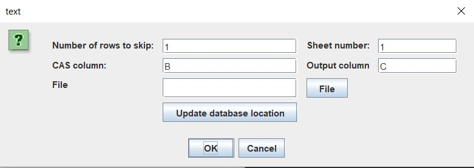

# CASnumber_lookup

Program to find chemical names from CAS numbers in an excel sheet

The program expects an excel sheet where CAS numbers are in one column. The user can define how many rows to skip, what column the CAS numbers are in, and what column the chemical names should be written in through a small GUI. The jar file for the program currently must be kept in the same directory as the excel file that functions as a database.

The program first checks the 'database' for the CAS number. If it is not found, then the NIST page is checked. If that is not found, then a search is run through another website. It is assumed that the CAS is found and a chemical name identified. The CAS and chemical name are added to the 'database'. The original excel sheet is updated to have the chemical names along with the CAS numbers. A message window lets the user new when the program is finished.

The excel 'database' must have two sheets. The first column of the first 50 rows contain the string 'none' as a quick and dirty work-around so that the row iterator can access them.

# Usage

## Build & Launch

```
mvn package
java -jar target/xlsxReader-0.0.3-SNAPSHOT-jar-with-dependencies.jar
```

After setting up your inputs (see below) press "OK" and the program
will attempt to look up the names corresponding to the CAS numbers.
The results will be written to the lookup "File" and also appended to the database file.

## Inputs



### File: The lookup file

This is the primary input of the program which contains the CAS numbers to look up.
See `examples/lookup.xlsx` for an example.
Select the file using the button "File".

### Update database location: The database file

This file is used by the program as a cache to store already looked up values.
See `examples/database.xlsx` for an example. 
Select the file using the button "Update database location".

### Number of rows to skip

This is used to skip a header row in the sheet. The default is 1 so that the first
row is ignored and can be used for the column labels like "CAS Number" or "Chemical Name".

### Sheet number

The number of the sheet (starting at 1) in the input file (lookup file) to use.
The default is 1 so the first sheet is expected to contain the CAS numbers to look up.
If you use the example "lookup.xlsx" you can leave this value as is.

### CAS column

The column in the sheet referenced by the sheet number which contains the CAS numbers to look up.
The default "B" references the second column. 
If you use the example "lookup.xlsx" you can leave this value as is.

### Output column

The column in the sheet referenced by the sheet number which you want the result of the lookup 
to be written to. By default this "C" and therefore writes the chemical name to the 3rd column.
If you use the example "lookup.xlsx" you can leave this value as is.

